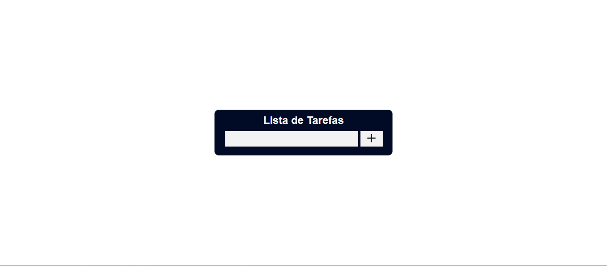
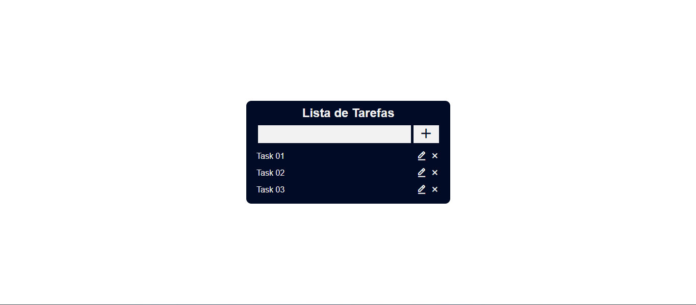

# List Tasts

## About
List tasks made in Angular framework, in order to test my initial knowledge in Angular.

## Features
### CRUD
- Create task
- Read task
- Update task
- Delete task

### Storage
- Local Storage

## Usage
1. Clone this repository
```bash
git clone https://github.com/LeoSantosp2/lista-tarefas-angular.git
```

2. Download the packages
```bash
npm i

# or

npm install
```

3. Execute the bellow command
```bash
npm run start

# or

ng serve --open
```

4. Access the link `http://localhost:4200`

## Screenshots




## License

[MIT](https://choosealicense.com/licenses/mit/)
